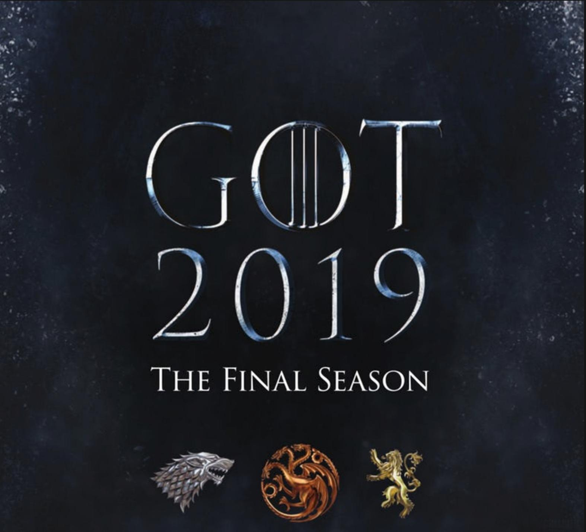

# GameofThronesSeasonTwo

权力游戏

 重返[临冬城](https://baike.sogou.com/lemma/ShowInnerLink.htm?lemmaId=74554623&ss_c=ssc.citiao.link)的[琼恩·雪诺](https://baike.sogou.com/lemma/ShowInnerLink.htm?lemmaId=30829138&ss_c=ssc.citiao.link)（[基特·哈灵顿](https://baike.sogou.com/lemma/ShowInnerLink.htm?lemmaId=62823072&ss_c=ssc.citiao.link) Kit Harington 饰）在[布兰·史塔克](https://baike.sogou.com/lemma/ShowInnerLink.htm?lemmaId=63001881&ss_c=ssc.citiao.link)（[伊萨克·亨普斯特德-怀特](https://baike.sogou.com/lemma/ShowInnerLink.htm?lemmaId=67620170&ss_c=ssc.citiao.link) Isaac Hempstead-Wright 饰）口中得知了自己身世的秘密，让他与丹妮莉丝·塔格利安（[艾米莉亚·克拉克](https://baike.sogou.com/lemma/ShowInnerLink.htm?lemmaId=62984180&ss_c=ssc.citiao.link)Emilia Clarke 饰）的关系蒙上了一层冰霜。[詹姆·兰尼斯特](https://baike.sogou.com/lemma/ShowInnerLink.htm?lemmaId=73846037&ss_c=ssc.citiao.link)（[尼古拉·科斯特-瓦尔道](https://baike.sogou.com/lemma/ShowInnerLink.htm?lemmaId=66207383&ss_c=ssc.citiao.link) Nikolaj Coster-Waldau 饰）试图召集河间地驻军北伐[异鬼](https://baike.sogou.com/lemma/ShowInnerLink.htm?lemmaId=66249988&ss_c=ssc.citiao.link)，却发现艾德慕·徒利（[托比亚斯·门基斯](https://baike.sogou.com/lemma/ShowInnerLink.htm?lemmaId=140647376&ss_c=ssc.citiao.link) Tobias Menzies 饰）已经包围了奔流城。[攸伦·葛雷乔伊](https://baike.sogou.com/lemma/ShowInnerLink.htm?lemmaId=71604041&ss_c=ssc.citiao.link)（[皮鲁·埃斯贝克](https://baike.sogou.com/lemma/ShowInnerLink.htm?lemmaId=155189448&ss_c=ssc.citiao.link) Pilou Asbæ 饰）将黄金团带至君临获取了瑟曦（[琳娜·海蒂](https://baike.sogou.com/lemma/ShowInnerLink.htm?lemmaId=859580&ss_c=ssc.citiao.link) Lena Headey 饰）的信任，而实际上，他已经与[无面者](https://baike.sogou.com/lemma/ShowInnerLink.htm?lemmaId=154819528&ss_c=ssc.citiao.link)[贾昆·赫加尔](https://baike.sogou.com/lemma/ShowInnerLink.htm?lemmaId=72633748&ss_c=ssc.citiao.link)（[汤姆·拉斯齐哈](https://baike.sogou.com/lemma/ShowInnerLink.htm?lemmaId=62983496&ss_c=ssc.citiao.link) Tom Wlaschiha 饰）私下达成了[秘密协议](https://baike.sogou.com/lemma/ShowInnerLink.htm?lemmaId=70079455&ss_c=ssc.citiao.link)。 

