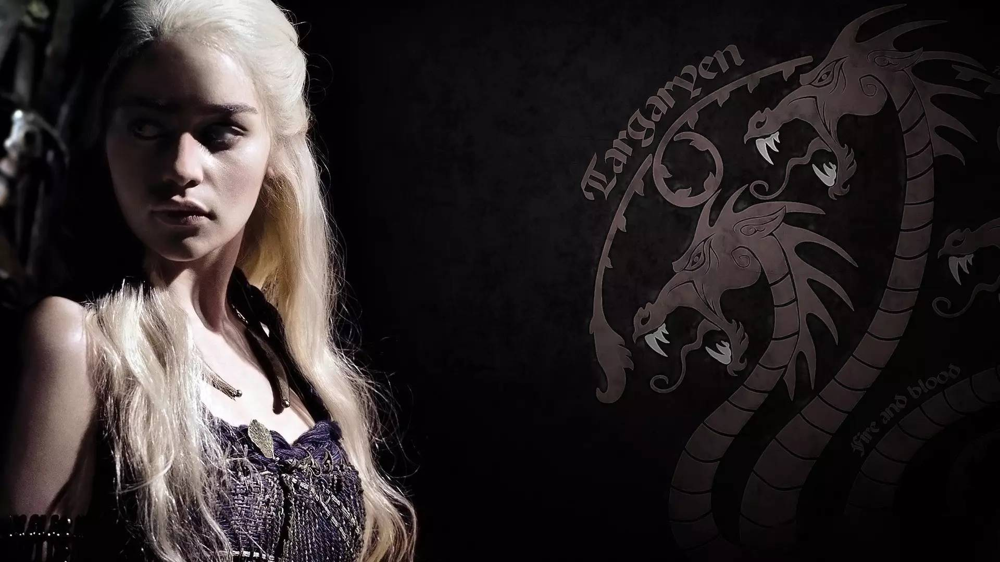
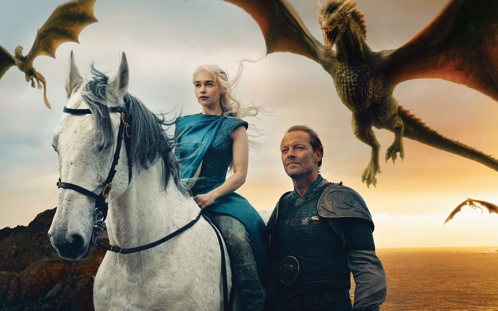

# GameofThronesSeasonTwo

权力游戏

 ~~重返临冬城的琼恩·雪诺（基特·哈灵顿 Kit Harington 饰）在布兰·史塔克（伊萨克·亨普斯特德-怀特 Isaac Hempstead-Wright 饰）口中得知了自己身世的秘密，让他与丹妮莉丝·塔格利安（艾米莉亚·克拉克Emilia Clarke 饰）的关系蒙上了一层冰霜。詹姆·兰尼斯特（尼古拉·科斯特-瓦尔道 Nikolaj Coster-Waldau 饰）试图召集河间地驻军北伐异鬼，却发现艾德慕·徒利（托比亚斯·门基斯 Tobias Menzies 饰）已经包围了奔流城。攸伦·葛雷乔伊（皮鲁·埃斯贝克 Pilou Asbæ 饰）将黄金团带至君临获取了瑟曦（琳娜·海蒂 Lena Headey 饰）的信任，而实际上，他已经与无面者贾昆·赫加尔（汤姆·拉斯齐哈 Tom Wlaschiha 饰）私下达成了秘密协议。~~ 

